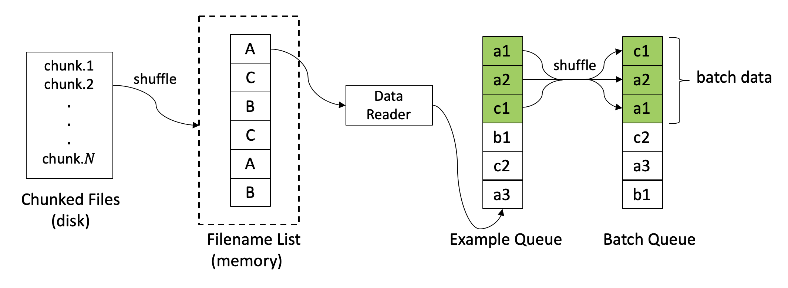

# PyLoader

[license-image]:https://img.shields.io/badge/License-Apache%202.0-blue.svg

[license-url]:https://github.com/iwangjian/pyloader/blob/master/LICENSE

[contributing-image]:https://img.shields.io/badge/contributions-welcome-brightgreen.svg?style=flat

[contributing-url]:to_be_add

[stars-image]:https://img.shields.io/github/stars/iwangjian/pyloader

[stars-url]:https://github.com/iwangjian/pyloader/stars

[forks-image]:https://img.shields.io/github/forks/iwangjian/pyloader

[forks-url]:https://github.com/iwangjian/pyloader/fork

[![License][license-image]][license-url]
[![Contributing][contributing-image]][contributing-url]
[![Star][stars-image]][stars-url]
[![Fork][forks-image]][forks-url]

🐳 PyLoader: An asynchronous Python dataloader for loading big datasets, supporting PyTorch and TensorFlow 2.x.


Have you ever encountered the problem that it's hard to load big datasets for training deep learning models in a single machine, especially when the datasets are too big (e.g., hundreds of GB, or even larger) while the machine's memory is limited? **PyLoader** is an easy-to-use toolkit for loading big datasets with limited memory using an asynchronous manner. It provides flexible interfaces to define your own ways to read data and customize data format. Since PyLoader is purely based on Python, it can be used under PyTorch and Tensorflow 2.x. The architecture of PyLoader is shown in the following figure.

<p align="center">
    
    <br>
    <b>Figure</b>: Overview of PyLoader architecture
</p>

## Installation
Currently, please install PyLoader via the following command:
```
git clone https://github.com/iwangjian/pyloader.git
cd pyloader
python setup.py install
```

## Quick Usage
PyLoader aims to make it flexible and easy-to-extend for loading big datasets in various tasks under the limitation of machine resource. There are several steps required for a quick start. 

**Step 1**: Suppose the original datasets are too big that you cannot load them once from disk into memory, you should first split the original datasets into an amount of chunked files. The size of each chunked file is determined by the machine and your design.

**Step 2**: Inherit the class `DataReader` and implement the method `read_file()`, which defines how to read a chunked file from disk.

**Step 3**: Inherit the class `Dataset` and implement the method `batch_encode()`, which defines how to encode data from raw format to numeric format (e.g., raw data is in the format of text).

**Step 4**: Inherit the class `DataCollator` and implement the method `collate_batch()`, which defines how to collate batches of data to tensors for model training.

The following code snippets show a simple workflow for using PyLoader.
```python
from pyloader import DataReader
from pyloader import Dataset
from pyloader import DataCollator
from pyloader import DataLoader

# Suppose all chunked files are placed under the folder YOUR_DATA_DIR
data_dir = YOUR_DATA_DIR

# Inherit the class `DataReader` and implement the method `read_file()`
class TheDataReader(DataReader):
    
    def __init__(self, batch_size=4, shuffle=False, random_seed=42):    
        super(TheDataReader, self).__init__(
            batch_size,
            shuffle=shuffle,
            random_seed=random_seed
        )

    def read_file(self, path):
        """
        Read files from disk. This function needs to be implemented.
        Args:
            path (string): the file path.
        Returns:
            dict_samples (Dict[str, List]): input samples, type: a dict of lists.
            n_sample (int): the number of samples.
        Raises:
            NotImplementedError: 
        """
        raise NotImplementedError

# Inherit the class `Dataset` and implement the method `batch_encode()`
class TheDataset(Dataset):

    def batch_encode(self, batch_data: Dict[str, List]) -> Dict[str, List]:
        """
        Encode batch data from raw format to numeric format.
        Args: 
            batch_data (Dict[str, List]): A dict of lists
        Returns:
            A dict of lists
        """
        raise NotImplementedError

# Inherit the class `DataCollator` and implement the method `collate_batch()`
class TheDataCollator(DataCollator):

    def collate_batch(self) -> Dict[str, Any]:
        """
        Take a dict of samples from a Dataset and collate them into a batch.
        Returns:
            A dict of tensors
        """
        pass

datareader = TheDataReader(batch_size=16, shuffle=True)
dataset = TheDataset()
datacollator = TheDataCollator()

# define a DataLoader
train_loader = DataLoader(
    datareader, dataset, datacollator, data_dir,
    num_epoch=5, max_queue_size=10, shuffle=True
)

# iteratively load data for training
for batch_step, inputs in enumerate(train_loader):
    for k, v in inputs.items():
        # define your code
        # ...
```

## Examples
To better understand how to use PyLoader flexibly, we provide some examples using PyTorch and Tensorflow 2.x. For usage under PyTorch, please refer to [`tests/test_pyloader_py.py`](https://github.com/iwangjian/pyloader/blob/main/tests/test_pyloader_py.py). For usage under Tensorflow 2.x, please refer to [`tests/test_pyloader_tf.py`](https://github.com/iwangjian/pyloader/blob/main/tests/test_pyloader_tf.py). The example data can be downloaded from [Google Drive](https://drive.google.com/file/d/1zqCq1OEewRAFWxNTGG1fjozgIsjS1XuO/view?usp=sharing) or [Baidu Netdisk](https://pan.baidu.com/s/1RvUEgQbRvHrOW5pbTVUBCw) (code: jky8).

## Contributing
We welcome all contributions from bug fixes to new features and extensions.

## License
PyLoader uses Apache License 2.0.
